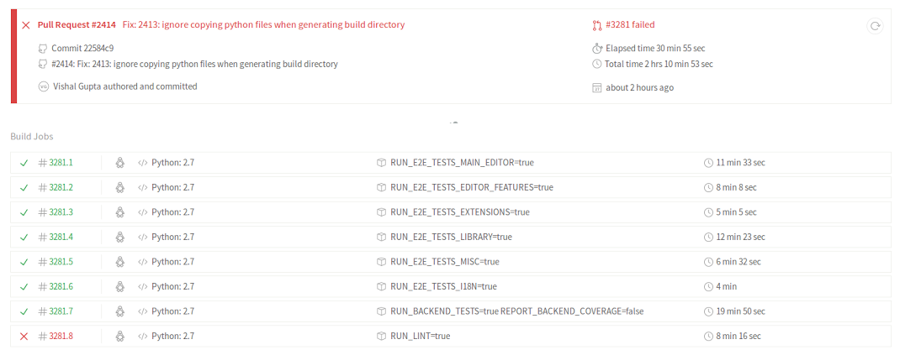

...do not despair! The failure may be due to one of two things:

- Your code is wrong.
- Travis is being flaky.

To figure out which it is, click the "Details" link at the bottom of the GitHub PR thread (at the right of "The Travis CI build failed"):

  

This will take you to the Travis dashboard for your PR. You can see which tests have failed (marked with an X) and which have stalled (marked with a !); both of these are errors that need to be resolved:

  

To figure out what you need to do next, click on the individual failed test(s) and have a look at the error log, then:

* If the error seems related to your PR, you probably have an error somewhere. You can try to reproduce the error locally: see the relevant section in [Running Tests](https://github.com/oppia/oppia/wiki/Running-Tests#end-to-end-tests) for instructions on how to run specific e2e tests on your local machine. If it still happens locally, then it's something that needs to be fixed. Note that all linter and backend errors fall into this category.

* If the error seems totally unrelated to your PR, or the test has just stalled (e.g. "Failed: Timed out waiting for Angular"), this might just be Travis being flaky. Make sure you're logged in to Travis (with your GitHub account), then go to the log for the failing test, and click the 'refresh' button in the top right of that specific test page. (Don't click the refresh button in the top right of the overall dashboard, unless you want to run *all* the tests again.) 
  - **Note:** If you're new to Oppia and haven't been added as a collaborator to the repository yet, you might not have permissions to restart the failing test. In that case, please ask on [Gitter](https://gitter.im/oppia/oppia-chat) if someone can help you out, and provide a URL to the Travis CI page for your PR.

Following these instructions should result in PRs that are green and ready to merge by the time a reviewer looks at them, thus shortening the review cycle!
