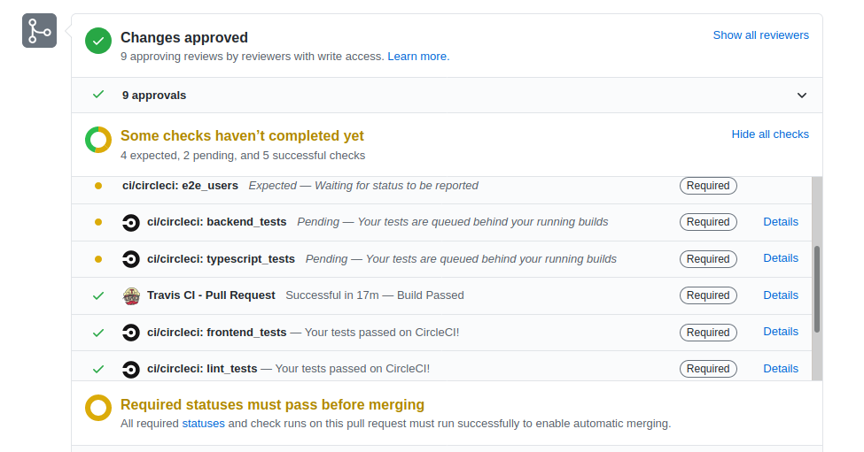
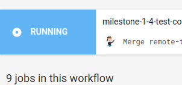
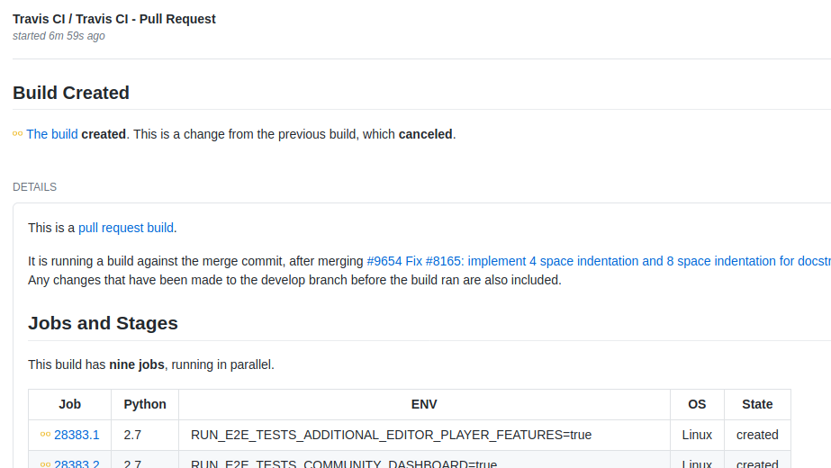

# Instructions for making PR passes

## Overview

The purpose of making manual passes over PRs is two-fold:

* To give a human touch to the PR process.
* To decrease the number of open PRs.

As of this writing, Oppiabot has been in operation for about 2 years with the goal of automating most of the processes that used to be done by the former maintainers group on a weekly basis. However, replacing a human with a bot resulted in decreased "warmth" in the review process and more PRs were being closed rather than being completed. After the dev workflow lead resumed the process of manually reviewing PRs, PRs were being completed faster and fewer were closed. Therefore, the community should strive to have a human in the review process as much as possible.

### For Core Maintainers:

The purpose of the rotation is to gauge the health the community and PR process, it is **not** to take over the responsibility of checking PR health. At the end of completing all of the steps below, you should be able to:

* Gauge the overall wellbeing of the community.
* Know the current responsibilities of individuals.
* Determine what dev workflow support the community requires.

Therefore, it is recommended to perform this pass the week before the monthly meeting so that the points above can be reported to the group. See [rota](#core-maintainer-rota) below.

## Cadence

Cadence depends on the task and increases the investment in time:

* Full Passes: Weekly
* Approved PRs Passes: Daily

## Full Pass

**Goal:** Move all PRs forward so that they aren't stale and ensure that the assignee field is accurate. Most importantly, to ensure that contributors aren't stuck (since some may not ask for help when they need it).

For **every** PR, perform the following:

1. If the contributor needs to take action and it's been at least 2 days since the last review, then:
   1. @-mention the contributor that they should take action or reach out if they have questions.
   2. Change Assignee to the contributor and unassign everyone else.
   3. **Note: If the contributor did not respond to the last ping, do not @-mention the contributor again, let Oppiabot automatically close the PR.**
2. If the PR received LGTM from all reviewers but tests failed, then:
   1. Check that the tests are not flaky, if so, restart them.
   2. If the tests are not result of flakiness, @-mention the reviewer that tests failed. Change Assignee to the contributor and unassign everyone else.
3. If the contributor pushed changes, no reviewer commented, and assignee is still the contributor, then:
   1. Comment that the contributor should @-mention any relevant reviewers
   2. Comment with @-mention the relevant reviewer(s) (if known) for them, and
   3. Assign the reviewers (if known).
4. If the contributor pushed changes, @-mentioned the reviewer, and assignee are the reviewers:
   1. Comment with @-mention to the reviewer reminding them to take a look.
5. If all tests pass and reviewers all provide LGTM, then:
   1. Check that there are no outstanding comments
      1. If there are none, then merge the PR.
      2. If there are any, please assign to the relevant party.

At the very end, ensure that no one contributor has too many open PRs (ie. over 3), if so, please encourage them to complete those PRs before opening new ones. Also, if there is a reviewer with a lot of PRs assigned to them, then it's worth starting a conversion whether the reviewer needs to focus their code ownership. Finally, if there are any community wide issues, please let the community and core maintainers know.

## Approved PRs

**Goal:** Merge as many approved PRs as possible.

1. Put in `is:pr is:open review:approved` in the PR query.
2. For every PR perform the following:
   1. If Github shows a green "Squash and merge" button, then:
      1. If there are no outstanding comments, then merge.
      2. Otherwise, @-mention the relevant party and adjust the assignee field accordingly.
   2. If there are failed tests, then restart the relevant suites only if they are known flaky suites. Otherwise, assign it back to the contributor and @-mention the contributor.

## Cancelling CI Builds

### Overview
Builds sometimes are cancelled for the following reasons:

* CI queue is very high.
* Contributor clearly needs to perform more work on the PR due to one of the following:
  * Merge conflict
  * Outstanding comments from reviewers.

Note: Please ensure that you logged into TravisCI or CircleCI, otherwise, you can't cancel.

### CircleCI
Keep in mind that it is not possible to cancel all CircleCI builds due to permission issues.

1. Click on any "Details" link that corresponds to CircleCI in the status checks section at the bottom.
   
2. Click on "circleci_tests" at the top section.
   
3. Click on the Cancel button in the top left.
   
   If you don't see the "Cancel" button, you can't cancel this build like the following:

   

### TravisCI

1. Click on Details in the test section for TravisCI.
   
2. Click on "The Build" on the TravisCI status page.
   
3. Click on the "Cancel Build" button on the right of the overview section.
   

## Core Maintainer Rota

It is recommended that the core maintainer complete their pass the week prior to the monthly meeting. However, they may choose to do it earlier if there are schedule constraints.

| Month     | Core Maintainer |
|-----------|-----------------|
| November  | Kevin Thomas    |
| December  | Nithesh         |
| January   | Srijan          |
| February  | Sean            |
| March     | Sandeep         |
| April     | Vojtěch         |